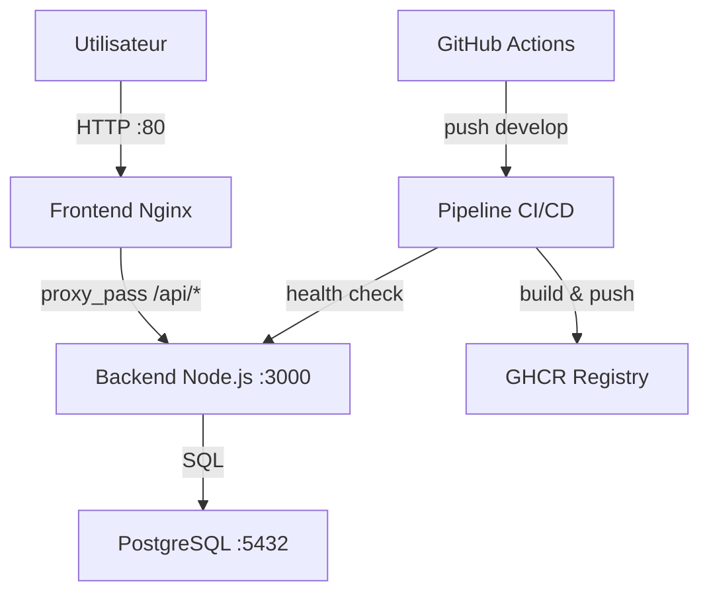

# VitalSync – Application de suivi médical et sportif

## Description

VitalSync est une application de suivi médical et sportif conteneurisée et déployée via une chaîne CI/CD complète. Elle se compose d'un back-end Node.js, d'un front-end Nginx et d'une base de données PostgreSQL.

## Architecture


## Prérequis

- Docker Desktop v29+
- Docker Compose v2.40+
- Git v2.x
- Node.js v20 LTS (pour développement local uniquement)

## Lancer l'application en local

1. Clone le dépôt :
```bash
git clone https://github.com/montajab14/vitalsync.git
cd vitalsync
```

2. Crée le fichier d'environnement :
```bash
cp .env.example .env
```

3. Lance les 3 services :
```bash
docker compose up --build
```

4. Accède à l'application :
- Frontend : http://localhost:80
- Backend API : http://localhost:3000/health

5. Arrêter les services :
```bash
docker compose down
```

## Pipeline CI/CD

La pipeline GitHub Actions se déclenche automatiquement sur chaque push sur `develop` et sur chaque Pull Request vers `main`. Elle comporte 3 étapes séquentielles :

1. **Lint & Tests** — ESLint sur le back-end + tests unitaires Jest
2. **Build & Push** — Construction des images Docker et push vers GHCR avec tag SHA du commit
3. **Deploy Staging** — Déploiement via Docker Compose + health check sur `/health`

La pipeline échoue si les tests ne passent pas, si le build Docker échoue, ou si le health check ne répond pas.

## Choix techniques

| Technologie | Justification |
|---|---|
| **Node.js 20 Alpine** | Image légère (~69MB) grâce au multi-stage build, LTS pour la stabilité |
| **Nginx Alpine** | Serveur de fichiers statiques minimal (~25MB), proxy_pass vers le back-end |
| **PostgreSQL 16 Alpine** | Base de données relationnelle robuste, image Alpine pour la légèreté |
| **GitHub Actions** | Intégration native avec GitHub, GITHUB_TOKEN sans configuration externe |
| **GHCR** | Registry natif GitHub, authentification via GITHUB_TOKEN, images co-localisées avec le code |
| **Multi-stage build** | Sépare les dépendances de build/test des dépendances de production |
| **Blue/Green deploy** | Rollback instantané en cas de problème, zéro downtime |
| **Gitflow** | Séparation claire develop/main, features isolées, protection de la branche stable |
